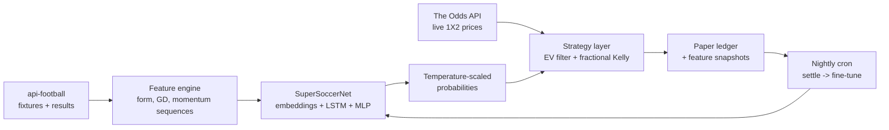

# quantbet — pricing soccer 1X2 markets with a calibrated deep model


An end-to-end research pipeline that prices soccer match outcomes, compares
model probabilities against live bookmaker odds, selects positive-EV bets
with fractional-Kelly staking, and **paper-trades them through a live ledger
with automated nightly settlement** — then evaluates itself honestly against
the one baseline that matters: the market.

> **This project's headline result is a documented failure.** 
> **[Read the full statistical analysis](docs/RESEARCH_NOTE.md)** — bootstrap CIs, calibration tests, and why the −18.3% ROI isn't even the damning statistic.
> Version 1 ran
> live for 11 weeks, logged 164 paper bets, and lost 18.3% of turnover. The
> post-mortem below traces exactly why (miscalibration, a feature bug, and a
> self-reinforcing retraining loop), and version 2 — this codebase — fixes
> every identified cause and adds the instrumentation that would have caught
> them. In betting, knowing precisely *why you lose* is the research skill.

**Educational/research project. Not financial advice. All wagers are paper
trades.**

---

## Pipeline



- **Model** (`quantbet/model.py`): team/league entity embeddings, an LSTM over
  each side's last 5 matches (GF/GA), and standardized form/goal-difference/
  match-importance features, merged into a 3-way softmax over Home/Draw/Away.
- **Calibration** (`quantbet/train.py`): temperature scaling fit on a
  chronological validation set. Betting compares probabilities to prices, so
  probability *calibration* — not accuracy — is the objective.
- **Strategy** (`quantbet/strategy.py`): pure, unit-tested EV and Kelly math
  with two profiles (`safe`: short-priced favourites, half-Kelly; `value`:
  larger disagreements, quarter-Kelly) and per-fixture correlation dedupe.
- **Live loop** (`quantbet/slip.py`, `settlement.py`, `retrain.py`): scans
  upcoming fixtures, logs recommended bets *with a snapshot of the exact
  model inputs*, grades them nightly via cron, and fine-tunes on settled bets
  with an experience-replay buffer.

## Methodology guardrails

These are the rules that make the numbers below trustworthy:

| Guardrail | Where |
|---|---|
| Chronological train/val/test splits — never random | `train.py`, `backtest.py` |
| Feature scaler fit on the training slice only | `train.py` |
| Rolling features built strictly from *prior* matches (regression-tested) | `features.py`, `tests/test_features.py` |
| Early stopping on validation **log-loss**, not accuracy | `train.py` |
| Post-hoc temperature scaling (Guo et al., 2017) | `train.py` |
| Retraining uses features snapshotted at bet time, never re-fetched later | `ledger.py`, `retrain.py` |
| Evaluation against de-overrounded market probabilities, not just outcomes | `backtest.py` |
| One canonical label encoding (0=Home, 1=Draw, 2=Away), enforced by tests | `features.py` |

## Results

### Offline (chronological holdout, 849 matches, 5 leagues, 2023–2026)

| Metric | Deep model (calibrated) | Poisson baseline¹ | Class prior |
|---|---|---|---|
| Log-loss | **1.0392** | 1.1094 | 1.0686 |
| Accuracy | 47.6% | **51.2%** | ~44% |
| Brier score | 0.6243 | **0.6091** | — |

¹ Time-weighted independent Poisson attack/defence model (Maher/Dixon-Coles
family), fitted on the identical training slice — `python -m quantbet baseline`.

The honest reading: **the deep model does not dominate the 40-year-old
classical baseline.** It wins on log-loss (fewer confidently-wrong tails) but
loses on accuracy and Brier. Whatever edge the extra machinery adds is
marginal on this data volume — which is itself a finding, and why the
feature-ablation item sits on the roadmap. Against the market
(142-match odds dataset, 29-match test slice): model log-loss 1.11 vs market
1.03 — **the model does not beat the market's prices**, and the repo says so
in its own backtest output. That is the expected result: efficient-market
priors should only be overturned by strong evidence, and 29 matches is not
evidence of anything.

### Live paper-trading forward test (v1 model, Feb–May 2026)

164 bets logged in real time before matches, settled automatically:

| Metric | Value |
|---|---|
| Settled bets | 162 |
| Hit rate | 27.2% |
| Avg odds taken | 4.69 |
| Avg model probability at bet time | 49.8% |
| ROI on turnover | **−18.3%** |

Reproduce from the committed ledger: `python -m quantbet report`.

### Post-mortem: why v1 lost, and what v2 changed

**1. Severe overconfidence.** The live calibration table
(claimed win probability vs. what actually happened):

| Claimed | n | Realized | Gap |
|---|---|---|---|
| 30–40% | 34 | 14.7% | −19.8 pts |
| 40–50% | 27 | 11.1% | −33.0 pts |
| 50–60% | 28 | 28.6% | −26.0 pts |
| 60–70% | 34 | 41.2% | −23.8 pts |

A model that says "44%" and delivers "11%" turns every EV calculation into
fiction. *Fix: temperature scaling on a held-out chronological slice, log-loss
early stopping, and this calibration report as a first-class CLI command.*

**2. A silent train/serve skew bug.** At inference time, the goal-difference
features the model was trained on were replaced with zeros by a slice typo,
so live predictions ran on inputs the network had never seen. *Fix: one
shared feature builder (`features.make_continuous`) used by training,
backtesting and live inference, with a regression test pinning the bug.*

**3. A self-reinforcing retraining loop.** The nightly job re-trained on the
same model-selected bets every night (drift toward a tiny biased sample) and
rebuilt their features from *current* API form — look-ahead leakage. *Fix:
bets store a feature snapshot at bet time, are consumed once, and are mixed
with a 400-match replay buffer; the selection-bias caveat is documented where
it can't be missed.*

**4. Adverse selection at high odds.** Average odds taken were 4.69 — the
"value" profile systematically bet where the model disagreed most with the
market, which is exactly where model error concentrates (winner's curse).
*Fix: EV is now computed from calibrated probabilities, the value profile is
capped at odds 8.0 and quarter-Kelly with a 2.5% bankroll ceiling — and the
backtest reports whether the model beats market log-loss at all before any
bankroll simulation is taken seriously.*

## Quickstart

```bash
git clone https://github.com/aykan2004/DL_SportsBettingBot && cd DL_SportsBettingBot
python -m venv .venv && source .venv/bin/activate
pip install -e ".[dev]"
cp .env.example .env   # add your api-football + The Odds API keys

pytest                          # 56 offline unit tests, no API keys needed
python -m quantbet train        # retrain from data/soccer_data_full.csv
python -m quantbet baseline     # classical Poisson benchmark, same holdout
python -m quantbet backtest     # historical-odds backtest + equity curve
python -m quantbet report       # live ledger PnL + calibration
python -m quantbet slip --profile safe   # scan fixtures, price, filter, log
python -m quantbet settle       # grade pending bets
```

Nightly automation (`master.py`, run from cron): settle yesterday's bets,
then fine-tune on the newly settled results.

## Project structure

```
quantbet/
  config.py      paths, leagues, API endpoints
  features.py    label encoding + leak-free rolling features (single source of truth)
  model.py       SuperSoccerNet + Mappings (vocab, scaler, temperature)
  api_client.py  stats/odds HTTP clients (session, retries, timeouts)
  strategy.py    EV, Kelly, strategy profiles, correlation dedupe (pure functions)
  slip.py        fixture scan -> probabilities -> filtered bet slip
  ledger.py      atomic paper-trading ledger with feature snapshots
  settlement.py  result lookup + pure grading rules (incl. DNB, voids)
  train.py       chronological training, early stopping, temperature scaling
  retrain.py     nightly fine-tune with experience replay
  backtest.py    market-baseline evaluation + Kelly bankroll simulation
  baselines.py   time-weighted Poisson benchmark (Maher/Dixon-Coles family)
  report.py      live PnL and calibration analysis
  cli.py         python -m quantbet {slip,settle,train,retrain,backtest,report}
data/            training CSV, historical odds dataset, live bet ledger
models/          trained weights + mappings.json
tests/           56 unit tests (strategy math, features, grading, ledger, model, inference glue)
```

## Known limitations (deliberately not hidden)

- **~4.5k training matches** is small for 264 team embeddings; regularization
  helps but rare teams are undertrained.
- The historical odds dataset (142 matches) is far too small for statistically
  significant backtests; it demonstrates the pipeline, not an edge.
- Odds come from a single bookmaker snapshot; no line shopping and no
  closing-line-value (CLV) tracking yet — CLV is the roadmap's top item, as
  it is the fastest-converging measure of bet quality.
- Match importance is a neutral constant at inference (the live API tier
  doesn't expose it), while training data has real values.
- Kelly treats each 1X2 leg as an independent binary bet; conservative here
  (one bet per fixture) but not the simultaneous-outcome optimum.

## Roadmap

1. CLV tracking: store the closing line for every logged bet; report beat-the-close rate.
2. Walk-forward (rolling-origin) evaluation instead of a single chronological split.
3. Feature ablations (does the LSTM branch actually pay rent over aggregate form?) and an ensemble of the deep model with the Poisson baseline, given their complementary metrics.
4. Dixon-Coles low-score correction and bivariate Poisson for the baseline.
5. Line shopping across bookmakers; execution at best available price.

## License

MIT — see [LICENSE](LICENSE).
