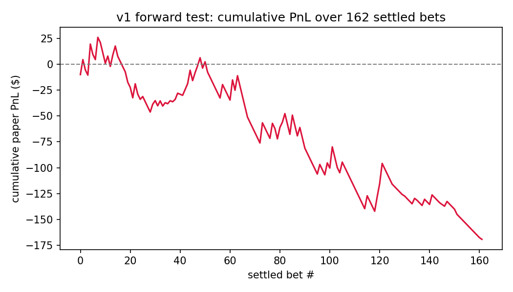
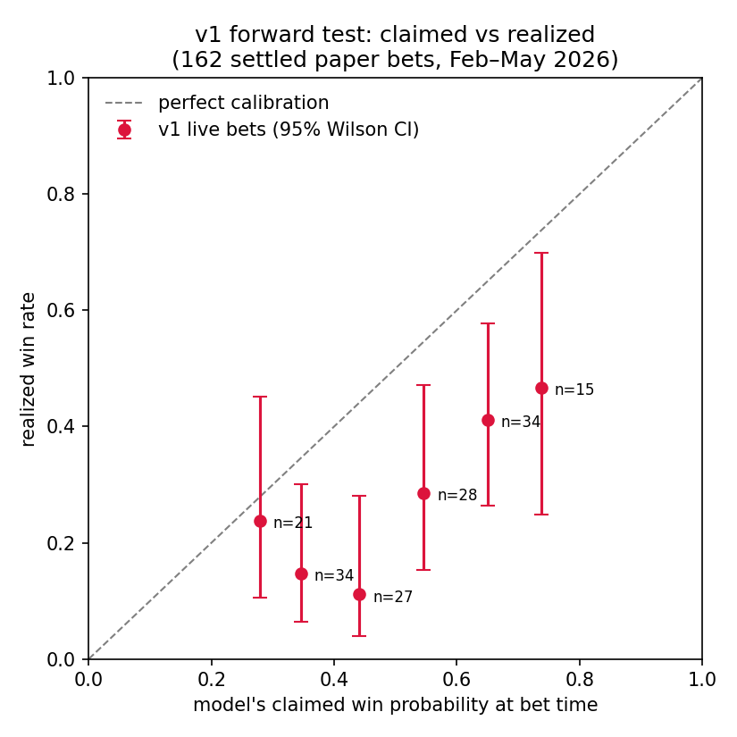
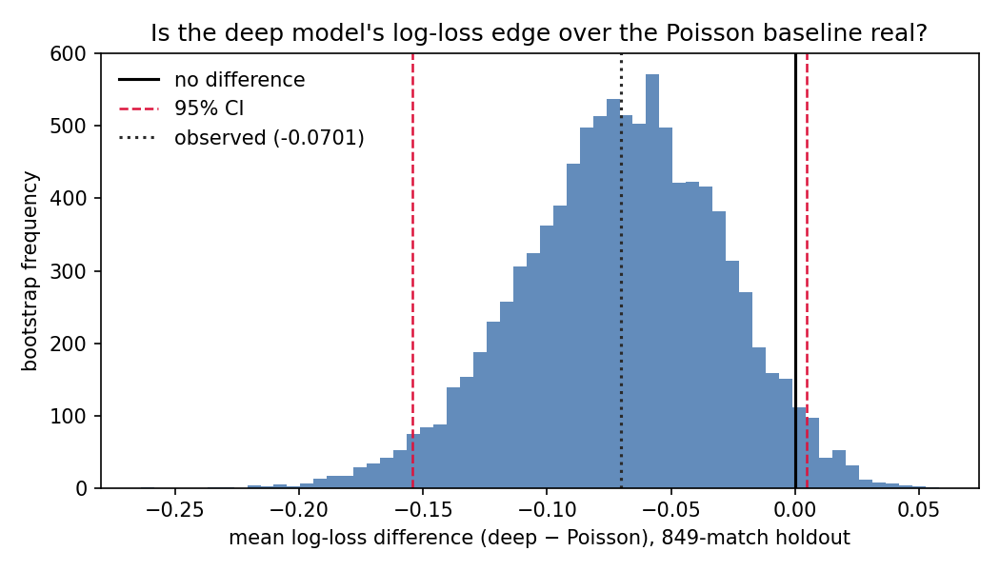
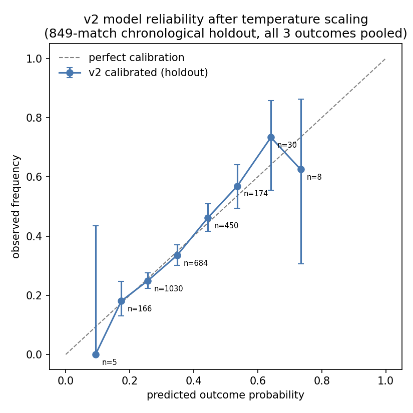

# When your model's own probabilities reject it: a statistical autopsy of a losing betting model, and what its replacement can (and cannot) claim

**Aykan Orscelik — research note accompanying [quantbet](../README.md)**

*Every number and figure in this note is generated by
[`analysis/make_research_note.py`](../analysis/make_research_note.py) from the
committed data: a seeded retrain on `data/soccer_data_full.csv`, the Poisson
baseline on the identical chronological split, the live paper-trading ledger
`data/bet_history.json`, and the historical-odds backtest slice. Run it from
the repo root to reproduce everything, including this note's tables
(`docs/research_note_stats.json`).*

---

## Abstract

Version 1 of this system paper-traded soccer 1X2 markets for 11 weeks and
lost 18.3% of turnover. This note asks the question a PnL number cannot
answer by itself: was that bad luck or a broken model? The answer is
unambiguous, but not where you'd expect. The ROI itself is *not*
statistically distinguishable from zero (95% bootstrap CI [−39.4%, +3.3%]) —
judged on money alone, v1 could have been an unlucky coin-flipper. What
convicts it is calibration: under the model's own claimed probabilities, the
162 settled bets should have produced 80.6 wins; they produced 44, a
**z = −6.07 (p ≈ 1.3 × 10⁻⁹)** rejection of the model by its own beliefs.
Meanwhile the same record is perfectly consistent with betting *at random* at
the market's prices (expected wins under break-even probabilities 1/odds:
50.9; z = −1.23, p ≈ 0.22). In other words: v1 carried no information beyond
the market's, and its probability outputs were fiction. The rebuilt system
(v2) fixes the identified causes, and this note evaluates it the same
skeptical way — with confidence intervals on every comparison. The honest v2
result: it significantly beats an uninformed prior, its apparent log-loss
edge over a classical Poisson baseline is **not statistically resolvable at
849 holdout matches** (p ≈ 0.07; roughly 2,200 matches would be needed), and
no conclusion of any kind can be drawn against the market from a 29-match
odds sample. The project's output is therefore not an edge; it is a
measurement apparatus that can now tell the difference.

---

## 1. Setting and prior

The system prices soccer match outcomes (Home/Draw/Away) with a hybrid
neural network, compares calibrated probabilities against live bookmaker
odds, and selects positive-EV bets sized by fractional Kelly. All wagers are
paper trades logged to a ledger with the exact model inputs snapshotted at
bet time.

The governing prior comes from financial economics: bookmaker closing lines
behave like asset prices, aggregating the information of the sharpest money
in the market. Kaunitz, Zhong & Kreiner (2017) showed that de-vigged closing
odds are close to unbiased estimates of true outcome probabilities — the
sports-betting analogue of weak-form market efficiency. Any residual,
exploitable mispricing should be expected only where limits to arbitrage
bind: bookmakers restricting winning accounts, fragmented liquidity across
books, and slower price discovery in low-liquidity leagues. Under that
prior, a claimed edge is an extraordinary claim, and the burden of proof sits
entirely on the model. This note is an exercise in carrying that burden
properly.

## 2. The v1 forward test: a statistical autopsy

v1 ran live from February to May 2026 and logged 164 paper bets before
kickoff (162 settled, 2 voided): hit rate 27.2%, average odds taken 4.69,
average claimed win probability 49.8%, ROI on turnover −18.3%.

**The ROI does not convict the model.** Bootstrapping the 162 settled bets
(resampling bets, ratio of total profit to total stake, 10,000 draws) gives a
95% CI of **[−39.4%, +3.3%]**. At odds averaging 4.69, per-bet variance is
enormous; eleven weeks of results cannot separate a modestly negative
strategy from a modestly positive one. Had v1 shown *+18.3%*, the same
arithmetic would apply — a lesson worth stating explicitly, because a green
equity curve of this length proves exactly as little as this red one.

**The calibration does convict it.** A probabilistic model makes a testable
claim with every bet: "this wins with probability p." Summing those claims
over 162 bets, v1 predicted **80.6 wins** for itself (variance Σp(1−p)); it
achieved **44**. That is z = −6.07, p ≈ 1.3 × 10⁻⁹ — the model's stated
beliefs are rejected at six sigma *by its own betting record*. Binned, the
picture is uniform: in five of six probability buckets the claimed
probability falls outside the 95% Wilson interval of the realized win rate
(e.g., bets claimed at 40–50% won 11.1% of the time, Wilson CI [3.9%,
28.1%]).

**And the market explains the residue.** If the model's probabilities were
pure noise and bets effectively random draws at the market's prices, the
expected win count under break-even probabilities 1/odds is 50.9. The
observed 44 sits comfortably inside that null (z = −1.23, p ≈ 0.22). The
complete story in two test statistics: **v1's record is incompatible with
its own claims (|z| > 6) and indistinguishable from uninformed betting at
market prices (|z| ≈ 1.2).** The model added no information; the −18.3% is
what paying variance (and the bookmaker's margin) at high odds looks like.

The methodological lesson generalizes: for low-frequency, high-variance
betting records, *calibration statistics converge orders of magnitude faster
than PnL*. The right question to ask a young strategy is not "is it making
money?" but "are its probabilities true?" — and the latter is answerable in
weeks.

## 3. Root causes and the v2 redesign

The engineering post-mortem (README, "Post-mortem" section) traced the
miscalibration to four concrete causes: accuracy-based early stopping with no
post-hoc calibration; a train/serve skew bug that silently zeroed the
goal-difference features at inference; a nightly retraining loop that
re-learned the same model-selected bets with look-ahead-contaminated
features; and adverse selection concentrated at high odds, where model error
is largest (the winner's-curse mechanism). v2 rebuilt the pipeline around one
shared feature builder with a regression test pinning the skew bug,
chronological splits with the scaler fit on the training slice only,
log-loss early stopping plus temperature scaling (Guo et al., 2017), bet-time
feature snapshots with an experience-replay buffer for retraining, and odds
caps with quarter-Kelly sizing on the value profile.

One detail worth noting: after switching the training objective to log-loss,
the fitted temperature came out at **T = 0.92** — the raw network is now
*slightly underconfident* before scaling. The gross overconfidence that
destroyed v1 was largely a product of the objective and the skew bug, not
something temperature scaling has to rescue; calibration is now a small
correction, verified rather than assumed.

## 4. v2 offline evaluation, with uncertainty this time

Chronological holdout: the final 849 matches (of 4,246 post-filter) across
five leagues, 2023–2026. Baselines fitted on the identical training slice: a
time-weighted independent Poisson attack/defence model (Maher 1982;
Dixon & Coles 1997) and the training-set class prior. All intervals are
95% paired bootstrap CIs over per-match losses (10,000 resamples) —
*paired*, because comparing models on the same matches removes the
match-difficulty variance that would otherwise swamp the signal.

| Comparison (log-loss, lower is better) | Mean diff | 95% CI | p (boot) |
|---|---|---|---|
| Deep (1.0392) − class prior (1.0686) | **−0.0294** | [−0.0444, −0.0143] | 0.0004 |
| Deep (1.0392) − Poisson (1.1094) | −0.0701 | [−0.1539, **+0.0046**] | 0.072 |
| Poisson (1.1094) − class prior (1.0686) | +0.0407 | [−0.0346, +0.1255] | 0.32 |
| Deep − Poisson, Brier score | +0.0152 | [−0.0087, +0.0388] | 0.21 |

Three findings, in decreasing order of comfort:

**The deep model demonstrably knows something.** Its log-loss edge over the
uninformed prior is small but precisely estimated and highly significant —
the only comparison in the table that clears conventional thresholds.

**Its apparent edge over the 40-year-old baseline is not statistically
real — yet.** The point estimate (−0.070) looks meaningful, but the CI
touches zero and the bootstrap p-value is 0.07. Reading the per-match
standard deviation of the loss difference (≈1.18) back through a standard
power calculation: detecting an effect of this size at 80% power would
require **≈2,200 holdout matches**, two and a half times what exists. This
reframes the roadmap: walk-forward evaluation is not a nice-to-have, it is
the only way to accumulate enough effective test data to answer the
question at all.

**The two models disagree about what they're good at, and neither claim is
settled.** Poisson wins the accuracy and Brier point estimates; the deep
model wins log-loss (fewer confidently-wrong tails). Both differences are
inside their intervals. Complementary error profiles with unresolved
rankings are precisely the situation where an ensemble is likely to
dominate both parents — which is why it sits on the roadmap ahead of any
architecture work.

Calibration, the property that killed v1, now holds on the holdout:

The pooled reliability curve tracks the diagonal within Wilson intervals
across the well-populated bins. The caveat that matters: this is *offline*
calibration. v1's offline calibration also looked acceptable; it was the
deployment path that broke it. The live calibration report
(`python -m quantbet report`) exists precisely because this property has to
be re-verified continuously in production, not certified once.

## 5. Against the market: the only comparison that pays, and the one we can't yet make

On the 29-match test slice of the historical odds dataset, model log-loss is
1.109 against the de-vigged market's 1.025. Paired bootstrap on the
difference: **+0.083, 95% CI [−0.045, +0.212], p ≈ 0.20**. The interval is
nearly three times wider than the deep-vs-Poisson interval on 849 matches,
and it comfortably contains zero from both sides: this sample cannot
distinguish "the model is far worse than the market" from "the model is
mildly better." The README's verbal caveat ("29 matches is not evidence of
anything") is now a number.

The prior from Section 1 says the point estimate — market ahead — is the
expected outcome, and it stands until strong evidence overturns it. Since
match outcomes are too noisy to supply that evidence at retail scale, the
economically literate substitute is **closing-line value**: log every bet's
price against the closing price. If a strategy systematically beats the
close, it holds information the market incorporated late — a signal that
converges in tens of bets rather than thousands, because it strips outcome
variance out entirely and measures information directly against the price
mechanism. CLV tracking is therefore the top roadmap item, ahead of any
modeling change.

## 6. What I now believe

The strongest claim this project can currently support: **it is a working
measurement instrument.** It can retrain its model reproducibly, evaluate it
against classical and market baselines on leak-free chronological data,
paper-trade it with settlement and audit trails, and — the part v1 lacked —
detect within weeks, from calibration alone, whether its probabilities are
fiction. What it cannot support is any claim of edge, and the analysis above
shows exactly how much data each such claim would require.

Next steps, in priority order: (1) CLV logging on every live bet; (2)
walk-forward (rolling-origin) evaluation to accumulate the ~2,200 effective
test matches the Poisson comparison needs; (3) shrinking model probabilities
toward the de-vigged market price before EV/Kelly (p_bet = w·p_model +
(1−w)·p_market), which encodes the efficiency prior directly in the staking
math and suppresses the winner's-curse selection that drove v1's high-odds
losses; (4) the deep+Poisson ensemble.

## 7. Reading that shaped this note

Dixon & Coles (1997), *Modelling Association Football Scores and
Inefficiencies in the Football Betting Market* — the baseline model family
and the time-decay weighting. Maher (1982) for the original independent
Poisson formulation. Guo, Pleiss, Sun & Weinberger (2017), *On Calibration
of Modern Neural Networks* — temperature scaling. Kaunitz, Zhong & Kreiner
(2017), *Beating the Bookies with Their Own Numbers* — closing-line
efficiency and why CLV is the right convergence-rate objective. Joseph
Buchdahl, *Squares & Sharps, Suckers & Sharks* and *Monte Carlo or Bust* —
the statistical treatment of betting records, including the
luck-vs-skill separation applied in Section 2. Constantinou & Fenton's
pi-ratings papers for an alternative rating-based feature family on the
roadmap for ablation.

---

*Reproduce: `python analysis/make_research_note.py` (retrains with seed 42;
regenerates `docs/figures/` and `docs/research_note_stats.json`). The live
ledger figures derive from the committed `data/bet_history.json`;
`python -m quantbet report` recomputes the headline live numbers
independently.*
